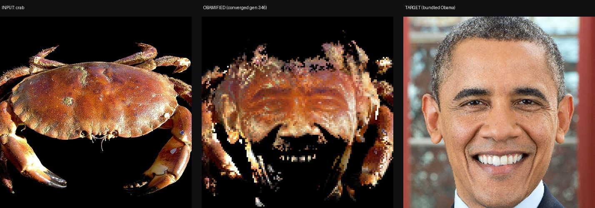

# obamify-py

<p align="center">
  
</p>

Turn any image into Obama. Every pixel of your image becomes a gene in a
population of 16,384; a genetic optimizer keeps swapping pixels around until
the shortest paths between them spell Obama. Your image isn't filtered or
blended — it's *rearranged*, tile by tile, so the output is literally your
picture cut into pieces and reassembled into a portrait.

Python port of [`Spu7Nix/obamify`](https://github.com/Spu7Nix/obamify), the
Rust + wgpu tool behind the Geometry Dash "obamify" video. Same heuristic,
same swap rule, same annealing schedule, same bundled Obama target and
weight map. Fully deterministic: same input + same seed = byte-identical
Obama, every run.

## Why

Because a crab can be Obama. Also: the swap-until-it-looks-right family of
algorithms is a fun read, and this port fits in ~200 lines of numpy versus
the original's wgpu compute setup.

## Install

```bash
pip install numpy pillow
```

No compilation, no GPU, no Rust toolchain. Runs anywhere numpy runs.

## Usage

```bash
python obamify.py input.jpg output.png
```

That's it. ~100 seconds on one CPU core for the default 128x128 grid.

Options:

```bash
python obamify.py input.jpg output.png --side 256        # higher res (16x slower)
python obamify.py input.jpg output.png --seed 7          # different Obama
python obamify.py input.jpg output.png --save-every 50   # dump frames each 50 gens
python obamify.py input.jpg output.png --quiet           # no progress spam
```

Python API:

```python
from PIL import Image
from obamify import obamify, resize_center

src = resize_center(Image.open("me.jpg").convert("RGB"), 128)
tgt = resize_center(Image.open("assets/target256.png").convert("RGB"), 128)
wgt = resize_center(Image.open("assets/weights256.png").convert("RGB"), 128)

img, generations = obamify(src, tgt, wgt, seed=12345)
img.resize((512, 512), Image.NEAREST).save("obamified.png")
```

## How it works

1. Your image is center-cropped and resized to 128x128 (16,384 pixels).
2. Each pixel starts at the grid slot matching its own position.
3. Every generation, 2,097,152 random swap pairs are proposed. A swap is
   accepted when it lowers the combined heuristic
   `color_err^2 * weight + (spatial_err * 13)^2`.
4. The weight map (bundled, red channel) says how much each slot cares about
   color vs position: the Obama silhouette region weighs 255, the
   background 1. This is why your image's background pixels get flung to the
   edges and the face assembles from your image's midtones.
5. Swap search distance starts at 128 and decays 0.99x per generation, so
   the algorithm goes from global shuffling to fine polishing. Converges
   around generation ~346.

The color term and the quadratic spatial term fight each other; the
optimizer resolves the fight by building Obama out of whatever you gave it.

## Determinism

Same input, same `--seed`, same output. Byte for byte. The RNG is numpy's
PCG64 seeded at 12345 by default. Useful if you want reproducible memes.

## Performance

| grid   | time (1 core) | pixels |
|--------|---------------|--------|
| 128    | ~100 s        | 16,384 |
| 256    | ~25-30 min    | 65,536 |

The vectorized core evaluates 4,096 candidate swaps per batch with array
gathers, ~6x faster than the naive scalar loop.

## Credits

- [`Spu7Nix/obamify`](https://github.com/Spu7Nix/obamify) — the original
  Rust implementation and algorithm. All credit for the core idea and the
  bundled Obama target/weights assets goes there.
- Chris Pratt — moral support
- Example crab photo: Hans Hillewaert, [CC BY-SA 4.0](https://creativecommons.org/licenses/by-sa/4.0/), via Wikimedia Commons
- The 3-hour debugging session that found a double-permutation render bug
  was brought to you by a Discord bet

## License

MIT for the code. The bundled `target256.png` and `weights256.png` come from
the original obamify repo — check there for their terms.
